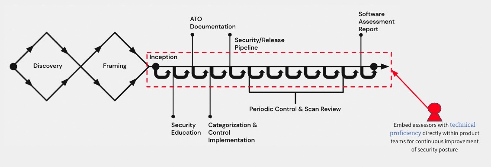

# High Level Approach

This page currently covers a brief description of approaches made to support establishing Ongoing Authorization and continuous Authority to Operate (cATO) for applications that are deploying onto a given platform.

- [Architecture Inheritance Model](#architecture-inheritance-model)
- [Ongoing Authorization Boundary](#ongoing-authorization-boundary)
- [Secure Release Pipeline Capabilities](#secure-release-pipeline-capabilities)
- [Application Security Assessors](#application-security-assessors)

 

## Architecture Inheritance Model
We leverage a modern architecture that allows us to build, deploy and monitor our applications. This is also the foundation to supporting a common control inheritance model through [common control providers](https://csrc.nist.gov/glossary/term/common_control_provider#:~:text=Definition(s)%3A,controls%20inherited%20by%20information%20systems). At the lowest level, a cloud environment serves as our infrastructure providing flexible compute and storage capabilities. Above that is a modern platform which provides both operating environments, as well as a secure mechanism for shipping applications. The cloud environment, the platform, and the secure release pipeline account for a percentage of NIST 800-53 Controls that are solely owned by each layer of the stack. This means that application development teams benefit in having an overall reduction in effort and responsibility for NIST 800-53 Controls that are addressed from the other layers in the stack, when shipping software onto the platform.

 

 

## Ongoing Authorization Boundary
The platform's Ongoing Authorization Boundary (also known as the *Accountability Boundary*) and approach to performing cATO covers the platform, secure release pipeline, custom applications/products deployed onto the platform, as well as any Commercial Off The Shelf (COTS) software that supports the operations of the platform or secure release pipeline (ie Auth0, Snyk, Aqua and SD Elements). All COTS software that is SaaS-based must complete the necessary accreditation for Federal Risk and Authorization Management Program (FedRAMP). All COTS software that is container-based should be accepted for use via an agency's [Technical Reference Model (TRM)](https://csrc.nist.gov/glossary/term/technical_reference_model) process.

 

 

## Secure Release Pipeline Capabilities
[Continuous Integration](https://www.martinfowler.com/articles/continuousIntegration.html) (CI) pipelines ensure that Application Development Teams can deliver frequent changes of software into production quickly and safely. Within the platform, app teams have the flexibility to build, test and deploy using whatever strategy is best suited for their product(s). However, before teams can deploy to the platform, they must be registered to and call the secure release pipeline. 

This pipeline service is only available to software development teams that are customers of the platform. The secure release pipeline enables security vulnerability detection and remediation guidance every time an engineer commits code changes to their teams repository. Upon each commit, the app team is receiving immediate feedback on security vulnerabilities for Static Application Security Testing (SAST), Software Composition Analysis (SCA) for open source packages, as well as vulnerabilities that exist within Image(s)/Container(s) being leveraged by the application. The secure release pipeline enforces [policies](policy.md) as gatecheck jobs, that must be adhered to in order for teams to achieve a [digitally signed](https://csrc.nist.gov/glossary/term/digital_signature) application image. Only images signed by the secure release pipeline are allowed onto the platform, and are validated by the platform prior to deployment.

 

 

## Application Security Assessors
If you recall the [RMF Structure](overview.md), there are two major steps of NIST RMF known as Assess and Authorize. At a high level, the Assess step is focused on having third party Assessors create an assessment plan that will be used to assess how the System Owning team implemented controls that were established during earlier steps of the RMF process, and then provide a report to the team and AO regarding the outcomes of the assessment. This assessment report provides findings and recommendations on deficiencies related to security risks. Deficiencies are either addressed before acquiring an ATO from an AO, or listed as a Plan of Action and Milestone (POAM) that will be addressed within a specified time period after acquiring an ATO and deploying to production.

Traditionally, System Owning teams would need to coordinate a week, or multi-week, long assessment exercise months in advance to provide adequate time to address NIST Controls and outcomes of the assessment exercise. This forces teams to operate with a waterfall schedule mentality, taking on coordination risks and planning around the availability of Assessors as well as the readiness of the system for assessment. This inevitably adds months of delay to a teams path to production, and often leads to a large list of unaddressed POAMs that then have long shelf lives before being mitigated.

Our approach is aimed at aligning security assessment practices to how modern software development teams actually develop and deliver products to end-users - iteratively and incrementally. As denoted by the image below, teams learn enough about the problem space and end-users they are solving for, as well as ideating through various solutions. It is at this point when an Application Security Assessor is embedded with the team throughout the lifecycle of their product and Software Development Lifecycle (SDLC). We also employ a COTS solution known as [SD Elements](https://www.securitycompass.com/sdelements/) which allows the System Owning team and Assessors to map out the various technology, architecture and risk vectors using a system survey and threat model diagram to drive [Control Selection](selection.md), implementation and assessment activities. This process of assessing risk and verifying that a security requirement has been met occurs as changes are introduced by the System Owning team or system dependencies. By iteratively and incrementally addressing small amounts of security risks, Assessors and System Owning teams have greater transparency and trust in the process of certifiying the product to go to production.

 

 
