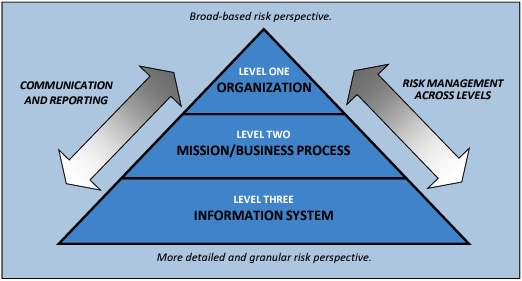
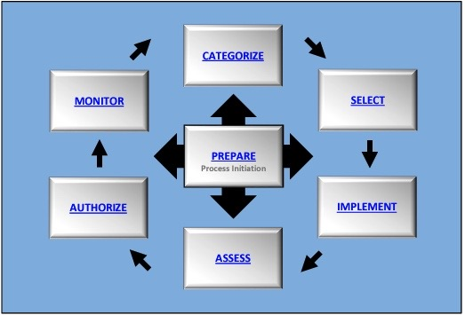

# Overview

As the Department of Veterans Affairs (VA) implements Development, Security and Operations (DevSecOps) methodologies, there is an opportunity to implement Continuous Authorization to Operate (cATO) practices that will enable real-time monitoring and continuous delivery of secure software. cATO represents a challenging but necessary enhancement of our cyber risk approach in order to accelerate innovation while outpacing expanding cybersecurity threats. Speed can only be achieved utilizing small, incremental changes that are easily tested and shipped into production[^1]. However, the quick pace of development can often outpace security and compliance practices that do not adapt and evolve with the times.

> ***Sacrificing security and compliance for speed is neither acceptable nor necessary.***

 
## NIST RMF Fundamentals

The [National Institute of Standards and Technology](https://www.nist.gov/) (NIST), and in partnership with other organizations, developed the [Risk Management Framework](https://csrc.nist.gov/projects/risk-management) (RMF) to improve information security, strengthen risk management processes, and encourage reciprocity[^2] among organizations which includes data privacy. NIST encourages organizations to employ, whenever possible, iterative and incremental approaches to ensure security and privacy requirements and controls are implemented, verified, and validated as development progresses throughout the life cycle. Security controls are aligned to a given systems unique security risk context via NIST Security and Privacy Controls for Federal Information Systems and Organizations[^3].

Organizations should maximize the use of ***automation***, wherever possible, to increase the speed, effectiveness, and efficiency of executing the steps in the Risk Management Framework (RMF). Automation is particularly useful in the assessment and continuous monitoring of controls, the preparation of authorization packages for timely decision-making, and the implementation of ongoing authorization approaches—together facilitating a real-time or near real-time risk-based decision-making process for senior leaders.

  

## RMF Org-Wide Risk Management

Effective NIST RMF is structured in an layered format that supports both bi-directional communication and reporting as well as risk management approach defined by boundaries of ownership. Application development teams align to Level 3 of an orgazniation-wide RMF approach as described by the image below, and focus on addressing direct and indirect[^4] risks tied to their *information system* boundary. Level 1 and 2 are responsible for employing systems and processes that information system owning teams will interact with throughout the software development lifecycle (SDLC), including day two operations such as incident response.

  

  

## RMF Structure

There are sevent steps in the RMF. While the RMF steps are listed in sequential order below, it's important to note that steps that occur after *Prepare*  can be carried out in a nonsequential order. This distinction aligns well with Agile and DevSecOps methodoligies where incremental and iterative adjustments that are introduced to a system come from a feedback loop with end-users, peer teams or data that exists from various monitoring solutions. The purpose of each step is outlined for you here:
- **Prepare** to execute the RMF from an organization- and a system-level perspective by establishing a context and priorities for managing security and privacy risk.
- **Categorize** the system and the information processed, stored, and transmitted by the system based on an analysis of the impact of loss.
- **Select** an initial set of controls for the system and tailor the controls as needed to reduce risk to an acceptable level based on an assessment of risk. 
- **Implement** the controls and describe how the controls are employed within the system and its environment of operation. 
- **Assess** the controls to determine if the controls are implemented correctly, operating as intended, and producing the desired outcomes with respect to satisfying the security and privacy requirements. 
- **Authorize** the system or common controls based on a determination that the risk to organizational operations and assets, individuals, other organizations, and the Nation is acceptable. 
- **Monitor** the system and the associated controls on an ongoing basis to include assessing control effectiveness, documenting changes to the system and environment of operation, conducting risk assessments and impact analyses, and reporting the security and privacy posture of the system.   

  

  

## Ongoing Authorization and cATO

Traditionally, the *Authorize* step of RMF is where a designated Authorizing Official (AO) will make an Authorization to Operate decision based upon:
1. A risk acceptance statement
2. Time or event-driven triggers for reviewi of the security and privacy posture of a given system (if any)

It's important to note that risks can be remediated, accepted with no intent to remediate or accept with a planned future remediation strategy - also known as a Plan of Action and Milestone (POAM).

 

***Ongoing authorization*** requires that “security controls and organizational risks are assessed and analyzed at a frequency sufficient to support risk-based security decisions to adequately protect organizational information”[^5]. Risk management can become near real-time by using the right balance of strategies for automation, technology, processes and people for the ongoing monitoring of controls and changes to systems and the environments in which those systems operate. Continuous monitoring based on the needs of the AO, produces the necessary ***current*** information to determine the security and privacy posture of a given system, and highlights their risks in an easy to consume manner. The following are critical to how we support cATO:

- **Cloud Adoption** reduces the amount of authorizations needed across the organization.
- **Common Control Inheritance** reduces the amount of security and compliance scope for products and applications being developed.
- **Automation** reduces the amount of manual work required for security categorization, control selection, assessment and monitoring.
- **Autonomy Requires Accountability** requires application development teams to responsibly manage their systems direct and indirect security risks.
- **Embedded Support** looks like cybersecurity certified specialists are now members of the application development team to rapidly assist with managing security risks 

  

*[cATO]: continuous Authority to Operate
[^1]: An environment where veterans can access the latest version of our software.
[^2]: Reciprocity is an agreement between organizations to accept one another’s security assessment results in order to reuse system resources or to accept each other’s assessed security posture in order to share information. 
[^3]: [NIST Special Publication 800-53](https://doi.org/10.6028/NIST.SP.800-53r5)
[^4]: As an example, risks that are associated with integrations to other systems.
[^5]: [NIST Special Publication 800-137](https://doi.org/10.6028/NIST.SP.800-137)
