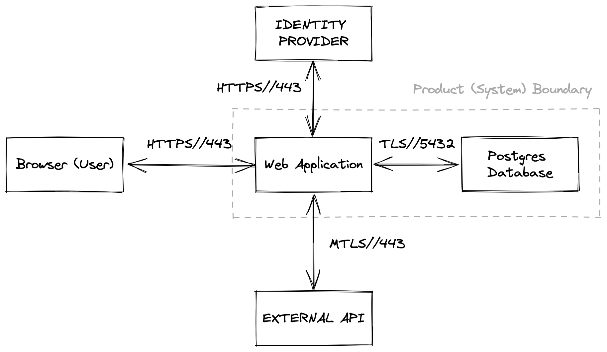

# System Diagram

## What are System Diagrams?
Similar to what was described in our approach for an [Ongoing Authorization Boundary](approach.md#ongoing-authorization-boundary), a system diagram is a visual representation of what components and connections exist in your application/product overall system boundary.

> The term system diagram is often referred to as an architecture diagram and include data flows between systems or sub-systems. 

 

## Why are they important?
System diagrams help making the identification of risks, easier, and it can help tailor what requirements will be in scope during the Control Selection process. The diagram is also utilized for threat analysis and part of your [Continuous Monitoring](monitoring.md) strategy. 

 

## How do I complete this task?
Organizations should be able to leverage any solution and medium they prefer, to create system diagrams. The only requirements are that System Owning teams must include the items listed below in their system diagram and information flow diagrams, and must maintain this artifact with the current and proposed future state of their system. This ensures that System Owning teams and Security Control Assessors are on the same page with changes to the systems risk landscape.

- Show all components that make up your overall system,
- Clarify which components your application team is responsible for maintaining, by drawing an authorization boundary around them,
- Clarify which components are not your application teams responsibility, by leaving them outside of the authorization boundary,
- Identify where any Federal Agency data is to be processed, stored, or transmitted,
- Clarify how all connections between components are handled, by including communication ports, protocols and direction of traffic (including the use of definitive agency DNS),
- Include a legend explaining your system diagram.

 

