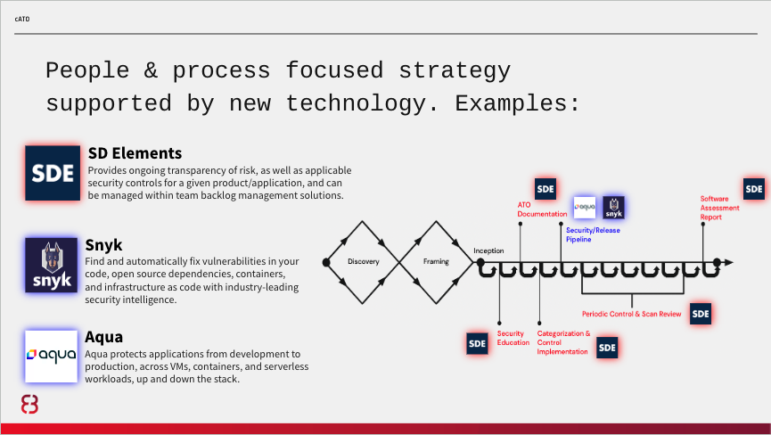
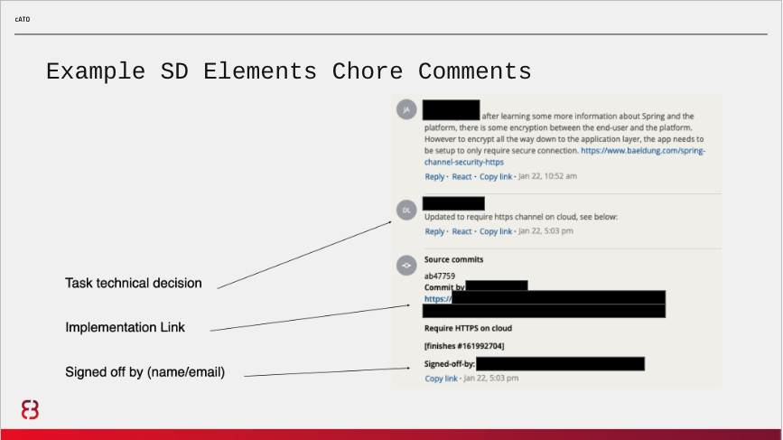
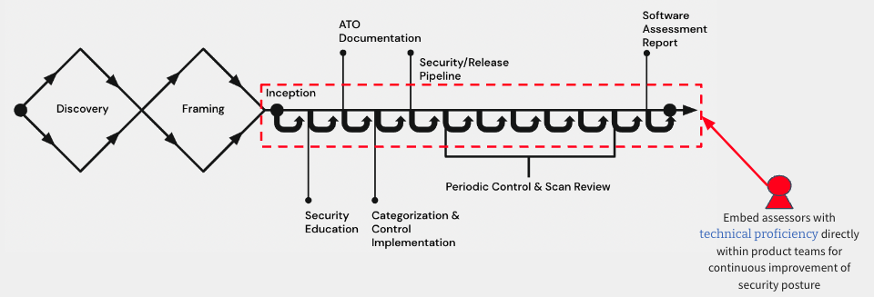

# Implement & Assess

Below is an example of integrated people, process, and technology supporting controls implementation and assessment performed in tandem to produce an authorization package that includes, at a minimum as per RMF, an executive summary, system security plan (SSP), privacy plan, security control assessment, privacy control assessment, and any relevant plans of action and milestones (POAM). RMF and cATO implementations are meant to be technology agnostic, and below is just an example.

The ideal situation is that control selection is tailored based upon the system authorization boundary that has been confirmed, and then further tailored to each service/application at the start of development. For systems that have already completed development, the same implementation documentation will be required but will likely take much longer to complete and assess.

## Security and Privacy Control Assessment

In the graphic above, let’s assume that the platform has a common controls authorization and we are deploying an application to it. After accounting for inheritance, SD Elements would run an application survey to determine what security requirements the application development team is uniquely responsible for, and any additional tailoring could be performed. These can be added to the team’s backlog via native integrations or API, creating a traceable identifier for each.

To start, we recommend a kickoff meeting with security (including privacy if the system is impacted):

- An hour meeting
- Assign the team an assessor
- Perform product architectural analysis
- Determines app-level categorization
- Select and assign team controls
- Assigned assessor will help team prioritize backlog

Assuming a code level implementation, the engineers would pick up the story, complete implementation and documentation, and assessor acceptance would be required, much like PM acceptance for user stories. It helps to standardize the way teams respond to these tasks:

- Describe the team’s technical decisions and task implementation details
- Provide a link to the code and/or regularly maintained artifacts to make reviewing easier
- Provide a technical point of contact with name and email, who signed for the task completion
- Add a security assessor assigned to the project as a reviewer for the completion of this story

The acceptance process might include reviewing the implementation in Git, requesting changes or additional information, and providing resources to help them with implementation (like SD Elements’ helpful context-specific training videos). Here is an example of a real back-and-forth between developer and assessor:

## Secure Release Pipeline

[Continuous Integration (CI)](https://www.martinfowler.com/articles/continuousIntegration.html) pipelines ensure that System Owning teams can deliver frequent changes of software into production quickly and safely. On a development platform, app teams have the flexibility to build, test and deploy using whatever strategy is best suited for their system. However, before teams can deploy to the platform, they must be registered to and call the secure release pipeline.

This pipeline service should only be available to software development teams that are customers of your platform. A strong secure and release pipeline enables security vulnerability detection and remediation guidance every time an engineer commits code changes to their repository. At a minimum, your pipelines should provide immediate feedback on security vulnerabilities for Static Application Security Testing (SAST), Software Composition Analysis (SCA) for open source packages, as well as vulnerabilities that exist within Image(s)/Container(s). The secure release pipeline enforces policies as gate-check jobs that must be adhered to in order for teams to achieve a digitally signed application image. Only images signed by your secure release pipeline should be allowed onto the platform, and are validated by the platform prior to upper environment deployments.

Vulnerabilities must be addressed by teams and validated by an assessor in accordance with the operating procedures your organization sets, including any changes over time. Operating procedures might, for instance, not allow critical or high severity vulnerabilities to be deployed into upper environments. As you mature, your secure release pipeline should also enforce adequate unit, journey, integration testing, and release engineering best practices.

Here are examples of how we used Snyk and Aqua in one implementation:

To ensure adequate progress throughout the course of development, we recommend periodic control and scan reviews such as:
Weekly meeting will be set between assessor and team

- Assigned assessor must have access to the team's backlog
- Help prioritize security controls
- Determine product security progress
- Answer any questions or concerns by the team

## SSP and POAM

The SSP and POAM should be digitized, and automation can be applied as your maturity increases. For instance, you could start with a low-fidelity automation to track the last time a new system architecture diagram was updated and trigger a manual review when it exceeds 30 days. Later, you might trigger the same rule when an integration is added but a new diagram was not uploaded. For POAMs, one could set automated alerts for milestones so they can be tracked and enforced. This ensures that planned actions are carried out or, if not feasible, deferred with assessor involvement.

The POAM describes the actions that are planned to correct deficiencies in a given control identified during the assessment of controls as well as during continuous monitoring. A POAM typically includes tasks to be accomplished with a recommendation for completion before or after system authorization; resources required to accomplish the tasks; milestones established to meet the tasks; and the scheduled completion dates for the milestones and tasks. POAMs are reviewed by the Authorizing Official (AO) to ensure there is agreement with the remediation actions planned to correct the identified deficiencies.

POAMs are not needed when deficiencies are accepted by the AO as residual risk, or, are remediated during an assessment and before a release. Residual risk is often covered by other controls that were fully and successfully addressed.

- Residual risk is defined as risk that remains after efforts to identify and mitigate said risk have been taken.
- Information System Security Officers (ISSO) or Application Security Assessors will monitor for new POAM items submitted for review, and report them to the AO as needed.

## Security and Privacy Assessment Report

If you follow the high-level approach laid out here, everything you need for the assessment report is already completed. You may have some work ahead of you if a particular format or system of record is required for documenting it. Again, we recommend getting an exception here to allow the report to be generated and stored in your native SDLC tools. Even if the data and artifacts aren’t aggregated and consolidated in the early days of cATO, that is ok. It is almost certainly in a better place than the rest of your enterprise, where systems are tracked primarily in spreadsheets, word docs and PDFs, and then manually transposed into systems of record like eMASS. Consolidating yours is an important part of improving the assessor and AO experience, and should be prioritized against other areas of improvement as you mature.

Security Control Assessors (SCA) should provide a Security Assessment Report (SAR) to AO regarding the outcomes of their assessment. This report provides findings and recommendations on deficiencies related to security risks. Deficiencies are either addressed before acquiring an ATO approval from an AO, or listed in the aforementioned POAM to be addressed within a specified time period after acquiring an ATO approval and deploying to production.

Traditionally, System Owners would coordinate a week, or multi-week long assessment exercise, months in advance to provide adequate time to address assessment, any remediation, and authorization. This forces teams to operate with a waterfall mentality, taking on coordination risks, and planning around the availability of Assessors as well as the actual readiness of the system for assessment. This typically adds months of delay to a team's path to production, focuses on an incomplete picture of known risks, and often leads to a large list of unaddressed POAM items that often go stale and are not addressed as planned, if at all.

Our approach is aimed at aligning NIST RMF steps and practices to how modern software development teams actually develop and deliver systems to end-users - iteratively and incrementally. As denoted by the image below, teams learn enough about the problem space, the end-users they are solving for, the data and types of technology that will be used to deliver the end results. It is at this point when an SCA (and privacy officer when applicable) is embedded with the team throughout the lifecycle of their system and Software Development Lifecycle (SDLC).

This process of assessing risks and verifying that requirements have been met occurs as changes are introduced by the System Owning team or system dependencies. By iteratively and incrementally addressing small amounts of security risks, Assessors and System Owning teams have greater transparency and trust in the process of certifying the system to go to production.

## A Note on Automation

We recommend starting simple and adding automation based on your largest bottlenecks. This looks very different in an organization with 5 apps versus 100, or with 100 users versus 100,000, or with 1,000 monthly API calls versus 10M. Trying to automate all the things on day 1 is a terrible strategy (you will fail) and unnecessary. The goal is risk management, and then continuous improvement. Sure, think big… but then start small and scale appropriately.

[OSCAL](https://pages.nist.gov/OSCAL/) looks promising when it comes to generating authorization packages dynamically, saving a great deal of time and money as [demonstrated by AWS](https://aws.amazon.com/blogs/security/aws-achieves-the-first-oscal-format-system-security-plan-submission-to-fedramp/) last year. We have built an OSCAL-based RMF platform and are beginning to implement it with our customers. In the future we may add implementations to the playbook or as an external reference.
