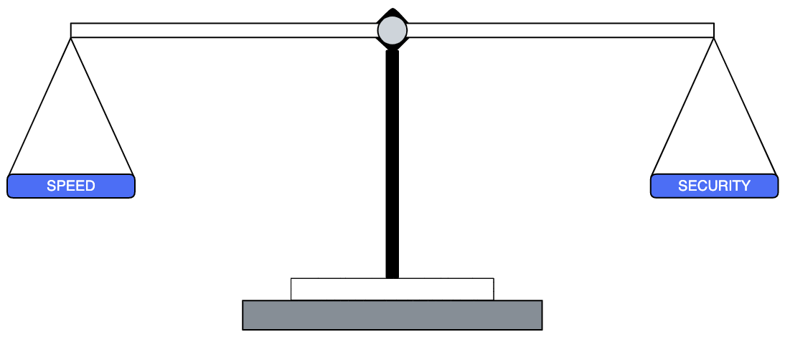

# Prologue

Because reliance on digital products and experiences that Veterans and their families depend upon is always growing, so too are the consequences of outages and cybersecurity threats. It is incumbent on organizations to understand the risks that a system introduces to their network, and to mitigate those risks to the greatest extent possible. Through a process of Certification and Accreditation, a system can be granted what is known as an Authority to Operate (ATO), which approves a system for use. The Federal Government uses ATOs to manage risk in their networks by evaluating security controls for new and existing systems. A tremendous amount of work and responsibility goes into certifying a system for use, and requires that an Authorizing Official (AO) be the individual who accepts both the benefits and risks of the system going into production to obtain and maintain their ATO. 

As software becomes more dependent on microservice-based architectures, and development teams invest in methodologies and technologies that enable unprecedented velocity to deliver both benefits and risks into production, we must continuously adapt and evolve our security practices to support future innovation at the VA. This will require exploration and experimentation of changes to the VA’s existing Risk Management Framework (RMF) process to grant and maintain system authorization for software development platforms using low-code development. The VA’s current RMF implementation[^1] focuses on obtaining system authorizations (ATOs), but falls short in supporting the speed and agility of modern software development and impending continuous monitoring of risk once system authorization has been reached. 

Our user research uncovered that application development teams have no awareness or working knowledge of what an ATO is, how to achieve one, nor that there are responsibilities they own on their path to production. If teams are not aware of what responsibilities they carry in terms of cybersecurity risk, and why it supports their goal of delivering value to Veterans, how can we assume that security risks are being mitigated to the greatest extent possible?

[^1]: [VA Handbook 6500](https://dvagov.sharepoint.com/sites/OITOIS/KnowledgeService/KSPublications/VA_Handbook_6500.pdf#search=6500)
