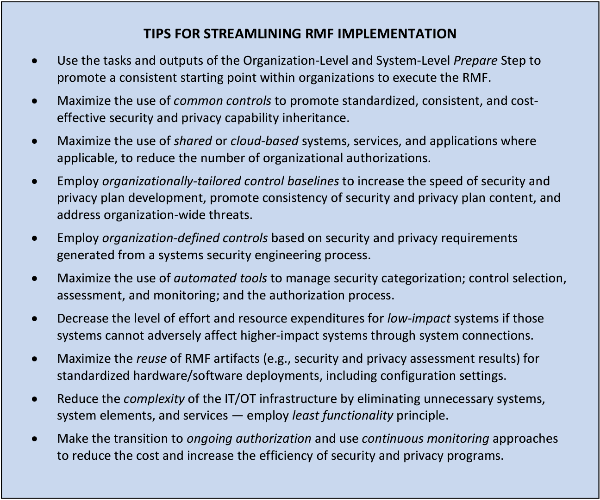

# Myths

## Myth 1: NIST RMF wasn’t designed with Agile and DevOps in mind

According to NIST SP 800-37, Revision 2 the RMF is technology agnostic and can be adapted for any development approach.

## Myth 2: The RMF doesn’t support the use of automation

NIST SP 800-37, Revision 2 encourages organizations to “maximize the use of automation, wherever possible, to increase the speed, effectiveness, and efficiency of executing steps in the RMF.” It includes automating the preparation for authorization packages as well as facilitating real-time decision-making.

## Myth 3: There is no flexibility in RMF implementation

NIST SP 800-37, Revision 2 states that organizations have significant flexibility in how they carry out the steps of RMF as long as they are meeting all applicable security and privacy requirements. That flexibility also applies to control selection, so anyone who complains about control applicability needs to read about control tailoring.

## Myth 4: The authorization boundary has to be drawn a certain way (e.g. around everything)

NIST SP 800-37, Revision 2 states the organization gets to establish the authorization boundary for systems and common controls. It later states that for software applications, “The software elements are included in authorization boundaries, either as part of the information system on which the software is hosted or as a part of an application-only system or subsystem that inherits controls from the hosting system. Software applications may depend on the resources provided by the hosting system and as such, can leverage the controls provided by the hosting system to help provide a foundational level of protection for the hosted applications.”

## Myth 5: The RMF doesn’t align with modern SDLCs

NIST SP 800-37, Revision 2 states that the best RMF implementation (remember, implementation is flexible and determined by the organization) is indistinguishable from the organization’s SDLC.

## Myth 6: There is no way to streamline RMF

NIST SP 800-37, Revision 2 gives you a whole list of tips for streamlining implementation:

***Now stop making excuses, and start making  🚀  happen!***
