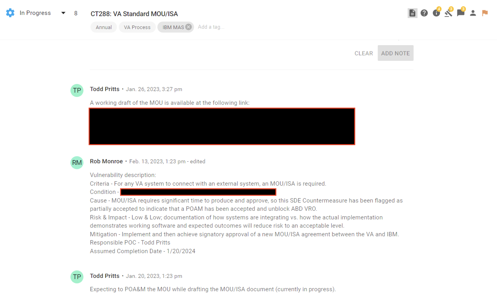
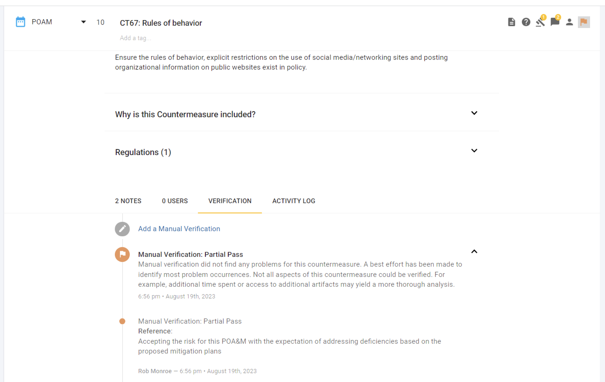

# Plan of Action and Milestones 

## What are POA&Ms?
The Plan of Action and Milestones (POA&Ms) describes the actions that are planned to correct deficiencies in a given control identified during the assessment of controls as well as during continuous monitoring. A POA&M includes tasks to be accomplished with a recommendation for completion before or after system authorization; resources required to accomplish the tasks; milestones established to meet the tasks; and the scheduled completion dates for the milestones and tasks. POA&Ms are reviewed by the Authorizing Official (AO) to ensure there is agreement with the remediation actions planned to correct the identified deficiencies.

 

## When are POA&M mitigations not required?
Deficiencies that are accepted by the AO as `residual risk`, or that are remediated during an assessment and before a release, do not require the documentation and monitoring of a POA&M. Residual risk is often covered by other controls that were fully, and successfully addressed.

- Residual risk is defined as risk that remains after efforts to identify and mitigate said risk have been taken.
- Information System Security Officers (ISSO) or Application Security Assessors will monitor for new POA&M items submitted for review, and report them to the as needed AO.

 

## How are POA&Ms created in Lighthouse?
When an Application Development Team and their Application Security Assessor determine that a requirement generated by our [Control Selection](selection.md) process will not be fulfilled prior to shipping to production on the LHDI platform, the Application Development Team will update their SD Elements countermeasure status to `POAM` to indicate a deficiency, and capture the risk details as a note within that countermeasure. An example of this action is shown in the image below, and the following data is required to formally request a POA&M be reviewed:

- **Criteria:** the reason why the requirement is applicable to the system
- **Condition:** current condition of the system regarding this requirement
- **Cause:** why this requirement will not be fulfilled prior to shipping to prod
- **Severity:** an assessment of relative importance of mitigation/remediating the weakness ([How to assess severity](#sev))
- **Impact:** the magnitude of potential harm to organizational operations as a result from the exploitation of identified vulnerabilities ([How to assess Impact](#impact))
- **Likelihood:** level of confidence that an identified vulnerability will be exploited ([How to assess likelihood](#like))
- **Mitigation:** the mitigation plan that will be executed
- **Responsible POC:** the key point of contact for this POAM item
- **Assumed Completion Date:** the date the team expects to have addressed mitigated this risk

 

 

### How to Assess Severity
| **Qualitative Values** | **Assessment Scale - Vulnerability Severity Description** |
|:---:|---|
| Very High | The vulnerability is exposed and exploitable, and its exploitation could result in severe impacts. Relevant security controls or other remediation are not implemented and not planned; or no security measure can be identified to remediate the vulnerability. |
| High | The vulnerability is of high concern, based on the exposure of the vulnerability and ease of exploitation and/or on the severity of impacts that could result from its exploitation. Relevant security controls or other remediation is planned but not implemented; compensating controls are in place and at least minimally effective. |
| Moderate | The vulnerability is of moderate concern, based on the exposure of the vulnerability and ease of exploitation and/or on the severity of impacts that could result from its exploitation. Relevant security controls or other remediation is partially implemented and somewhat effective. |
| Low | The vulnerability is of minor concern, but effectiveness of remediation could be improved. Relevant security controls or other remediation is fully implemented and somewhat effective. |
| Very Low | The vulnerability is not of concern. Relevant security controls or other remediation is fully implemented, assessed, and effective. |
 

### How to Assess Impact
| **Qualitative Values** | **Assessment Scale - Impact of Threat Events Description** |
|:---:|---|
| Very High | The threat event could be expected to have multiple severe or catastrophic adverse effects on organizational operations, assets, individuals other organizations, or the Nation. |
| High | The threat event could be expected to have a severe or catastrophic adverse effect on organizational operations, assets, individuals, other organizations, or the Nation. As an example, the threat event may: <ul><li>cause severe degradation or loss of mission capability to an extent and duration that the organization is not able to perform one or more of its primary functions</li><li>result in major damage to organizational assets</li><li>result in major financial loss</li><li>or result in severe or catastrophic harm to individuals involving loss of life or serious life-threatening injuries</li><ul> |
| Moderate | The threat event could be expected to have a serious adverse effect on organizational operations, assets, individuals, other organizations, or the Nation. As an example, the threat event may: <ul><li>cause significant degradation in mission capability to an extent and duration that the organization is able to perform its primary functions, but the effectiveness is significantly reduced</li><li>result in significant damage to organizational assets</li><li>result in significant financial loss</li><li>or result in significant harm to individuals that does not involve loss of life or serious life-threatening injuries</li><ul> |
| Low | The threat event could be expected to have a limited adverse effect on organizational operations, assets, individuals, other organizations, or the Nation. As an example, the threat event may: <ul><li>cause a degraded mission capability to an extent and duration that the organization is able to perform its primary functions, but the effectiveness is noticeably reduced</li><li>result in minor damage to organizational assets</li><li>result in minor financial loss</li><li>or result in minor harm to individuals</li><ul> |
| Very Low | The threat event could be expected to have a negligible adverse effect on organizational operations, assets, individuals, other organizations, or the Nation. |

 

#### Types of Impact
| **Type of Impact** | **Impact Examples** |
|:---:|---|
| Harm to Operations | <ul><li>Inability to perform and/or restore mission/business functions, now or in the future, and to the extent that it harms financials, sanctions, relationships, etc.</li><li>Within planned resource constraints</li><li>In a sufficient timely manner</li><li>With sufficient confidence and/or correctness</li><li>With applicable laws or regulations</li><li>With contractual requirements or other requirements in other binding agreements</li><li>Damage to relationships, brand, or reputation</li><ul> |
| Harm to Assets | <ul><li>Damage to or loss of information systems or networks</li><li>Damage to or loss of information technology or equipment</li><li>Damage to or loss of information assets</li><li>Loss of intellectual property</li><ul> |
| Harm to Individuals | <ul><li>Injury or loss of life</li><li>Physical or psychological mistreatment</li><li>Identity theft</li><li>Loss of sensitive data (VA data, PII, PHI, SPI, etc.)</li><li>Damage to relationships, brand, or reputation</li><ul> |
| Harm to Other Organizations | <ul><li>Harms financials, sanctions, relationships, etc. due to noncompliance</li><li>With applicable laws or regulations</li><li>With contractual requirements or other requirements in other binding agreements</li><li>Damage to relationships, brand, or reputation</li><ul> |
| Harm to the Nation | <ul><li>Damage to or incapacitation of a critical infrastructure sector</li><li>Loss of business/government continuity of operations</li><li>Damage to relationships with other governments or nongovernment entities</li><li>Damage to national reputation</li><li>Damage to current or future ability to achieve national objectives such as national security</li><ul> |

 

### How to Assess Likelihood

| **Likelihood** | **Very Low Impact** | **Low Impact** | **Moderate Impact** | **High Impact** | **Very High Impact** |
|:---:|:---:|:---:|:---:|:---:|:---:|
| **Very High Threat** | Very Low | Low | Moderate | High | Very High |
| **High Threat** | Very Low | Low | Moderate | High | Very High |
| **Moderate Threat** | Very Low | Low | Moderate | Moderate | High |
| **Low Threat** | Very Low | Low | Low | Low | Moderate |
| **Very Low Threat** | Very Low | Very Low | Very Low | Low | Low |

 

## How are POA&Ms accepted or denied in Lighthouse?
Once a POA&M request has been confirmed by an Application Security Assessor or Information System Security Officer (ISSO), it will be reviewed with an Authorizing Official (AO), or a designated delegate. The AO, their deligate, an Application Security Assessor or ISSO can perform any one of the actions described below, to communicate a formal decision for the POA&M being reviewed. In the case of an Application Security Assessor or ISSO performing a formal decision for a POA&M, they must also include evidence from the AO or delegate, concurring with the decision (e.g. email response) as an additional note within the countermeasure. 

| **Update Verification Status to...**  | **POA&M Decision Translation**  | **SDE Countermeasure Example** |
|:---:|---|---|
| `Pass` | <ul><li>A deficiency still remains after assessment</li><li>All mitigation strategies have beeen exhausted</li><li>All remaining risk has been accepted as residual risk by their AO or delegate</li><li>The team is not blocked from deploying to production</li><ul> |  |
| `Partial Pass` | <ul><li>A deficiency still remains after assessment</li><li>A post release mitigation plan, proposed by the Application Development Team, has been approved by their AO or delegate</li><li>The team is not blocked from deploying to production</li><ul> |  |
| `Fail` | <ul><li>The AO or delegate have denied the Application Development Teams post release mitigation plan proposal</li><li>The team is blocked from deploying to production until they either fully mitigate[^1] or reduce the risk to an acceptable residual risk level</li><ul> |  | 

 

[^1]: When a POA&M has been fully mitigated, the SD Elements countermeasure status will transition from `POAM` to `Complete` indicating that the POA&M no longer exists. All historical data for POA&M requests and approvals against a countermeasure will persist for auditing purposes.  
