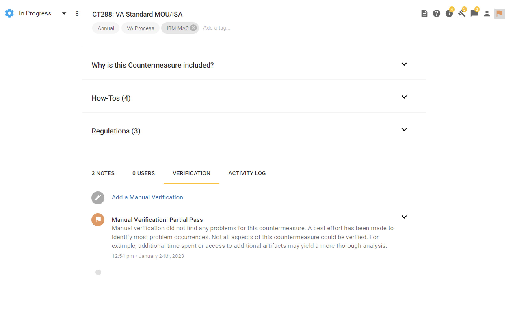

# Plan of Action and Milestones 

## What are POAMs?
The plan of action and milestones (POAMs) describes the actions that are planned to correct deficiencies in the controls identified during the assessment of the controls and during continuous monitoring. The plan of action and milestones includes tasks to be accomplished with a recommendation for completion before or after system authorization; resources required to accomplish the tasks; milestones established to meet the tasks; and the scheduled completion dates for the milestones and tasks. The plan of action and milestones is reviewed by the authorizing official to ensure there is agreement with the remediation actions planned to correct the identified deficiencies.

 

## When are POAMs not required?
Deficiencies that are accepted by the authorizing official as `residual risk`, or are remediated during an assessment, do not require the documentation and monitoring of a POAM.

- Residual risk is defined as risk that remains after efforts to identify and mitigate said risk have been taken.
- App Assessors are authorized to make and report these determination to the Authorizing Official.

 

## How are POAMs created in Lighthouse?
When a product team and their App Assessor determine that a requirement generated by our [Control Selection](selection.md) process, will not be fulfilled prior to shipping to production on LHDI, the first step taken is to generate a vulnerability description. This response will be captured as a note within the specific SD Elements requirement backlog item. An example of this action is shown below, and the following data is required to have a complete POAM response:

- **Criteria:** the reason why the requirement is applicable to the system
- **Condition:** current condition of the system regarding this requirement
- **Cause:** the reason why this requirement will not be fulfilled prior to the system shipping to prod
- **Risk & Impact:** Low/Medium/High designations and reasons why
- **Mitigation:** the mitigation plan that will be executed
- **Responsible POC:** the key point of contact for this POAM item
- **Assumed Completion Date:** the date the team expects to have addressed mitigated this risk

 

 

## How are POAMs accepted in Lighthouse?
Once a POAM response has been established, the App Assessor will review the details with an Authorizing Official (or designated delegate). If the risk is accepted, one of the following actions can be taken to update the status of a specific SD Elements requirement backlog item. An example of how this is displayed to users in SD Elements is shown below.

1. The Authorizing Offical (or designated delegate) can log into SD Elements, add a note indicating they're accepting the risk, and update the verifaction status tp `partial pass`.
2. The App Assessor can update the verifaction status to `partial pass` as long as they have obtain evidence of the Authorizing Officials (or designated delegate) risk acceptance (e.g. email response), and included within the SD Elements requirement backlog item  

 

 

## How are Countermeasure Status vs. Verification Status used?
Every SD Elements countermeasure (i.e. requirement) has a status that product teams will update from `Incomplete`, to `In Progress`, and finally to either of the three available done status which are `Complete`,`Inherited`, or `Not Applicable`.

- **Complete** indicates that the team has successfully addressed the requirement, and is ready for an App Assessor to verify the implementation details.
- **Inherited** is used when the team believes the requirement is fulfilled, and thus can be fully inherited, by a different component (e.g. LHDI, a shared authentication service, or even a VA organization such as Privacy), and is ready for an App Assessor to verify.
- **Not Applicable** is used when the team believes the requirement does not pertain to their application/product at all, and is ready for an App Assessor to verify.

 

Every SD Elements countermeasure also has a Verification Status, which is used to confirm that the risk identified has been addressed. App Assessors will update Verification Status from `no verification status` to either `pass` or `partial pass`. Partial pass is strictly reserved for identifying requirements that have been POAM'd for reporting and traceability purposes. The following combinations of Countermeasure Status and Verification Status are used to indicate specific decisions that have been made with POAMs

| **Countermeasure Status**           | **Verification Status**             | **POAM Action Translation**                                                       |
|-------------------------------------|-------------------------------------|-----------------------------------------------------------------------------------|
| `Incomplete`                        | `Partial Pass`                      | Deficient requirement that is backlogged, and will be addressed in future sprints |
| `In Progress`                       | `Partial Pass`                      | Deficient requirement that is actively being addressed                            |

