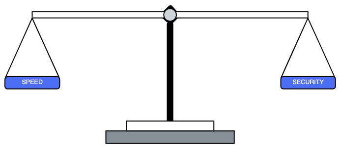

# Prologue

This Lighthouse cATO playbook is a living document[^1] describing the people, processes and technology we leverage. The intent of this playbook is to help educate readers on our cATO practices in a concise, and consumable way. We highly recommend that everyone reading or referring to this playbook, should watch 🎥 [Continuous ATO: RMF & Ongoing Authorization](https://www.youtube.com/watch?v=k4lO3-9kIM0) before proceeding to any other page within this playbook.
 

Because reliance on digital products and experiences that Veterans and their families depend upon is always growing, so too are the consequences of outages and unaddressed cybersecurity threats. It is incumbent on organizations, and application development teams, to understand the risks that a system introduces to the network, and to mitigate those risks to the greatest extent possible. Through a process of Certification and Accreditation, a system can be granted what is known as an Authority to Operate (ATO), which approves a system for use. The Federal Government uses ATOs to manage risk in their networks by evaluating security controls for new and existing systems. A tremendous amount of work and responsibility goes into certifying a system for use, and requires that an Authorizing Official (AO) be the individual who accepts both the benefits and risks of the system going into production for the first time and while maintaining their ATO. 

  
As software becomes more dependent on microservice-based architectures, and development teams adopt methodologies and technologies that enable unprecedented agility of changes, we must continuously adapt and evolve our security practices to support **continuous assessment and monitoring of risks**. This will require adjustments to the Department of Veterans Affairs (VA) existing Risk Management Framework (RMF) process to experiment on how we grant and maintain system authorization for software development platforms using low-code development. The VA’s current RMF implementation[^2] focuses on obtaining system authorizations (ATOs), but falls short in supporting the speed and agility of modern software development and impending continuous monitoring of risk once the system authorization has been achieved. 

> ***User research that we conducted prior to implementing any experiment with the Lighthouse Program uncovered that Application Development Teams had limited to no awareness or working knowledge of what an ATO is, how to achieve one, nor that they had direct responsibilities tied to their path to production. This begs the question - if teams are not aware of what responsibilities they own in terms of cybersecurity risk, and how it supports their goal of delivering value to Veterans, then how can we assume that security risks are being mitigated to the greatest extent possible?***

 
[^1]: We maintain the documentation so that it represents how we manage cybersecurity risks and threats.
[^2]: [VA Handbook 6500](https://dvagov.sharepoint.com/sites/OITOIS/KnowledgeService/KSPublications/VA_Handbook_6500.pdf#search=6500)

